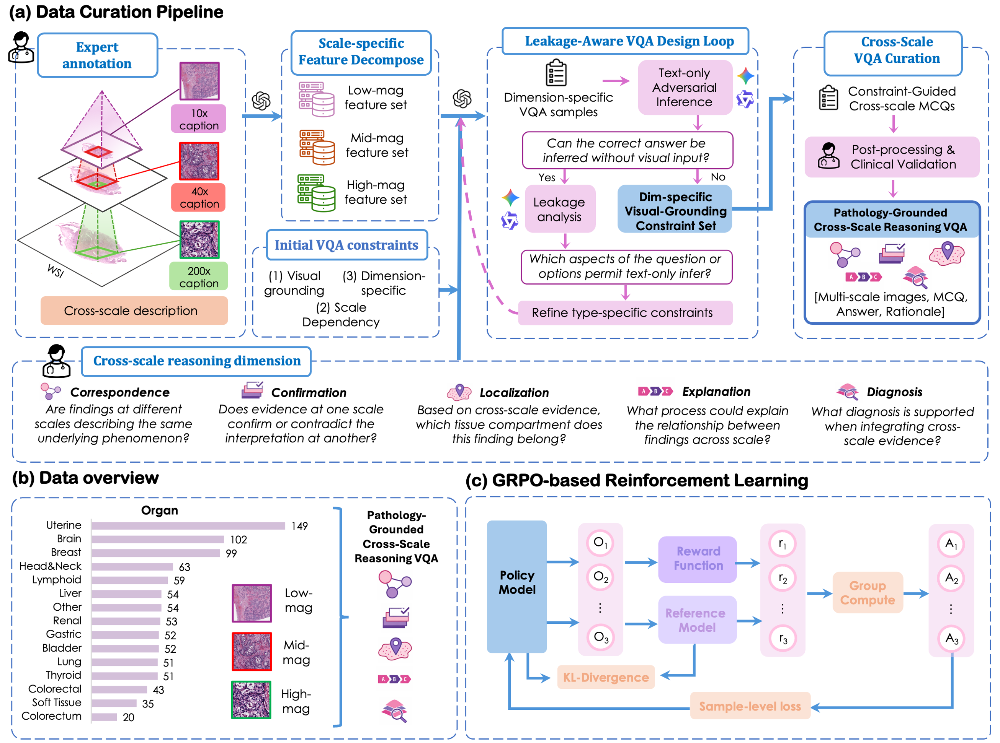
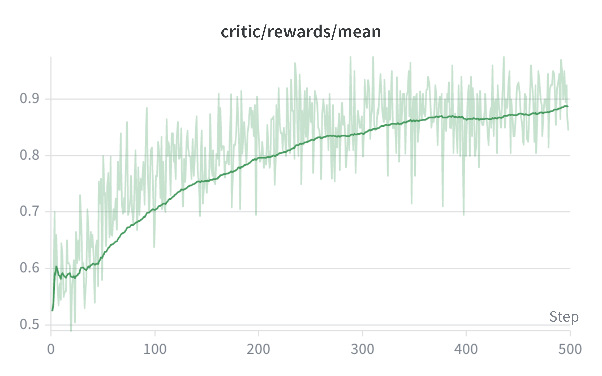
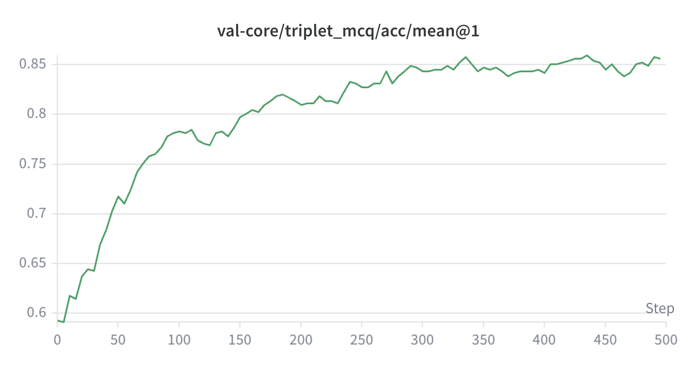
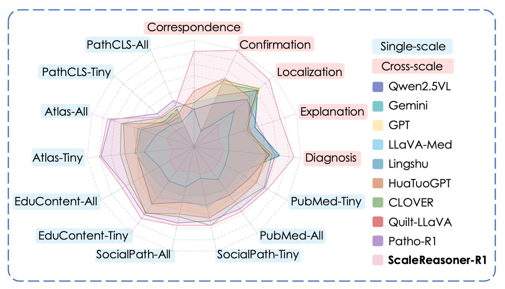

<h1 align="center">[MICCAI 2026] Enhancing Pathological VLMs with Cross-scale Reasoning</h1>

<p align="center"> Chi Phan*, Tianyi Zhang*, Qiaochu Xue, Yufeng Wu, Dan Hu, Zeyu
Liu, Sudong Wang, Yueming Jin </p>

<p align="center">
  <a href="https://conferences.miccai.org/2026/en/default.asp">
    
  </a>
  <a href="https://arxiv.org/abs/2606.17412">
    
  </a>
  <a href="https://huggingface.co/ChiPhan1110/ScaleReasoner-R1">
    
  </a>
    <a href="https://huggingface.co/ChiPhan1110/ScaleReasoner-R1">
    
  </a>
</p>

## 🔬 Overview
Pathological diagnosis is inherently multi-scale: pathologists reason from global tissue architecture at low magnification down to cellular morphology at high magnification, integrating evidence across views before reaching a conclusion.  While existing pathological datasets for vision-language models (VLMs) include various scales, they often lack explicit cross-scale reasoning objectives. This limitation prevents VLMs from capturing essential cross-scale representations and learning evidence-based reasoning. 

We introduce the **first cross-scale training and evaluation paradigm** for pathological VLMs, along with:

- **Scale-VQA** - a high-quality benchmark of 4,685 leakage-aware multiple-choice questions grounded in multi-magnification pathology images across 15 organs and 5 clinically-aligned reasoning dimensions.
- **ScaleReasoner-R1** - a pathology VLM trained with Group Relative Policy Optimization (GRPO) that achieves state-of-the-art performance on cross-scale multi-image VQA and transfers strongly to established single-image benchmarks.

## 🧩 Method

<div align="center">


**(a)** Leakage-aware curation pipeline for Scale-VQA. **(b)** Dataset overview across organs and magnifications. **(c)** GRPO-based reinforcement learning framework for ScaleReasoner-R1.
</div>

### Scale-VQA: Leakage-Aware Cross-Scale Benchmark

Naively constructed cross-scale VQA benchmarks suffer from **text-only shortcut solutions** — models can infer the correct answer from linguistic or biomedical priors without ever examining the images. Our curation pipeline eliminates these via three steps:

| Step | Description |
|------|-------------|
| **Scale-specific Feature Decomposition** | Expert annotations are decomposed into per-scale evidence sets; initial visual-grounding and scale-dependency constraints are imposed. |
| **Text-only Adversarial Screening** | Gemini 3 Pro and Qwen3-Max act as text-only adversaries. If either model answers correctly without images, constraints are tightened and questions are regenerated. |
| **Cross-scale MCQ Construction & Clinical Validation** | Final MCQs are reviewed by senior pathologists to confirm that correct answers are visually grounded and distractors are clinically plausible. |

### ScaleReasoner-R1: Cross-scale Reasoning via RL
ScaleReasoner-R1 is initialized from **Patho-R1-7B** and fine-tuned with **GRPO** on Scale-VQA. Given a multi-scale image set $I = \{I^{10\times}, I^{40\times}, I^{200\times}\}$, a question, and options, the model generates a structured response with a reasoning trace (`<think>`) followed by a final answer (`<answer>`).

**Training Dynamics:**

<div align="center">

| Training Reward | Validation Accuracy |
|:-------------------:|:---------------:|
|  |  | 
</div>

## 🏆 Results
<div align="center">

</div>

### Cross-scale Multi-image VQA

| Model | Corresp. | Confirm. | Localiz. | Explan. | Diagno. | **AVG** |
|-------|:--------:|:--------:|:--------:|:-------:|:-------:|:-------:|
| Qwen2.5-VL-7B | 41.79 | 47.26 | 71.14 | 44.28 | 63.68 | 53.63 |
| Gemini 3 Flash | 48.26 | 58.71 | 71.64 | 53.73 | 72.14 | 60.90 |
| GPT-5.2 | 47.76 | 59.70 | 74.13 | 45.77 | 65.17 | 58.51 |
| LLaVA-Med-7B | 25.87 | 16.92 | 28.36 | 20.90 | 24.88 | 23.38 |
| Quilt-LLaVA | 32.34 | 14.43 | 45.27 | 30.35 | 29.35 | 30.35 |
| CLOVER | 37.31 | 61.69 | 73.13 | 46.27 | 65.77 | 56.82 |
| Patho-R1 | 31.84 | 40.30 | 59.70 | 56.22 | 68.66 | 51.34 |
| **ScaleReasoner-R1** | **80.60** | **89.05** | **84.58** | **76.12** | **84.08** | **82.89** |

### Single-image VQA (PathMMU)

| Model | Overall | PubMed | SocialPath | EduContent | Atlas | PathCLS |
|-------|:------------:|:------:|:----------:|:----------:|:-----:|:-------:|
| Patho-R1 | 64.8 | 68.7 | 63.9 | 65.7 | 73.5 | 41.8 |
| **ScaleReasoner-R1** | **66.2** | **71.2** | **67.6** | **67.6** | **79.3** | 37.9 |

---

## 📁 Repository Structure
```text
ScaleReasoner-R1/
├── assets/                          
├── data/                            # Cross-scale VQA json by split
├── preprocess/
│   ├── generate_vqa_data/           # Feature extraction, VQA generation, split creation
│   └── prompts/                     # Leakage-aware prompt templates and constraints
├── script/
│   ├── preprocess/                  # End-to-end preprocessing entrypoints
│   ├── train/                       # SFT and GRPO launch scripts
│   └── postprocess/                 # Postprocess after training
├── LLaMA-Factory/                   # SFT training framework          
└── verl/                            # RL training framework                            
```
## 🚀 Getting Started

### Environment Setup

```bash
# Clone the repository
git clone https://github.com/iMVR-PL/ScaleReasoner-R1.git
cd ScaleReasoner-R1

# Set up environment variables
cp script/.env.example script/.env
# Edit script/.env with your paths and API keys
```

Configure `script/.env`:

```bash
# Data paths
DATA_DIR=/path/to/triplet_raw_data
ROOT=/path/to/ScaleReasoner-R1
PROCESSED_DIR=/path/to/processed_data

# Model paths
ACTOR_MODEL_DIR=/path/to/patho-r1-7b   # base model (Patho-R1-7B)
RESULTS_DIR=/path/to/results

# Logging
LOG_DIR=/path/to/logs
WANDB_DIR=/path/to/wandb

# API keys (for VQA generation pipeline)
GEMINI_API_KEY=...
OPENAI_API_KEY=...
DASHSCOPE_API_KEY=...
HF_TOKEN=...
```

**RL environment (verl).** ScaleReasoner-R1 is trained with [verl](https://github.com/volcengine/verl). Please follow the [verl installation guide](https://verl.readthedocs.io/en/latest/start/install.html) to set up the environment, then install the local copy:

```bash
conda create -n verl python=3.10 -y && conda activate verl
pip install -e verl/
```

**SFT environment (LLaMA-Factory).** The SFT baseline uses [LLaMA-Factory](https://github.com/hiyouga/LLaMA-Factory):

```bash
conda create -n sft python=3.10 -y && conda activate sft
pip install -e LLaMA-Factory/
```

> Both environments require CUDA 12.1+ and PyTorch 2.3+. We recommend using separate conda environments for RL and SFT to avoid dependency conflicts.

## 🗂️ Dataset

Download **Scale-VQA** from [HuggingFace](https://huggingface.co/datasets/iMVR-PL/Scale-VQA). The `data/` directory contains the train/val/test splits in JSON format. Each sample includes:

```json
{
  "question": "...",
  "options": { "A": "...", "B": "...", "C": "...", "D": "..." },
  "answer": "D",
  "rationale": "...",
  "image_path": {
    "low_mag":  "wsi_id/rois/10_....jpg",
    "mid_mag":  "wsi_id/rois/40_....jpg",
    "high_mag": "wsi_id/rois/200_....jpg"
  }
}
```

## 🤖 Training & Inference

### RL Training (ScaleReasoner-R1)

We use [**verl**](https://github.com/volcengine/verl) for GRPO-based RL training:

```bash
conda create -n verl python=3.10 -y && conda activate verl
pip install -e verl/

bash script/train/run_grpo_cross_scale_vqa.sh
```

Key hyperparameters: `n=5` rollouts per question, `total_epochs=5`, `train_batch_size=32`. The custom reward function is at `verl/verl/utils/reward_score/cross_scale_vqa.py`.

### SFT Baseline

We use [**LLaMA-Factory**](https://github.com/hiyouga/LLaMA-Factory) for supervised fine-tuning:

```bash
conda create -n sft python=3.10 -y && conda activate sft
pip install -e LLaMA-Factory/

bash script/train/run_sft_pathor1_new_triplet_mcq_think_only.sh
```

### Inference

Download **ScaleReasoner-R1** from [HuggingFace](https://huggingface.co/ChiPhan1110/ScaleReasoner-R1). ScaleReasoner-R1 was trained to produce structured outputs using `<think>` and `<answer>` tags. To ensure reproducible results, pass the system prompt below: 

```python
SYSTEM_PROMPT = (
    "You are a pathology expert. Read the question and options about the image carefully. "
    "Think step by step inside <think> </think>. Then output ONLY the SINGLE best option letter "
    "inside <answer> </answer>.\n"
    "Example: <think>Your reasoning</think> <answer>A</answer>. "
    "Do not include the option text or any extra words inside <answer> </answer> tags."
)
```

**Option 1 — vLLM server (recommended for batched evaluation)**

```bash
vllm serve <path/to/ScaleReasoner-R1> \
    --host 0.0.0.0 \
    --port 8000 \
    --tensor-parallel-size 1 \
    --max-model-len 8192 \
    --limit-mm-per-prompt.image 5 

```

Then query via the OpenAI-compatible client:

```python
from openai import OpenAI
import base64

def encode_image(path):
    with open(path, "rb") as f:
        return base64.b64encode(f.read()).decode("utf-8")

client = OpenAI(base_url="http://localhost:8000/v1", api_key="token")

response = client.chat.completions.create(
    model="ChiPhan1110/ScaleReasoner-R1",
    messages=[{
        "role": "user",
        "content": [
            {"type": "image_url", "image_url": {"url": f"data:image/jpeg;base64,{encode_image('low_mag.jpg')}"}},
            {"type": "image_url", "image_url": {"url": f"data:image/jpeg;base64,{encode_image('mid_mag.jpg')}"}},
            {"type": "image_url", "image_url": {"url": f"data:image/jpeg;base64,{encode_image('high_mag.jpg')}"}},
            {"type": "text", "text": "<question>\n(A) ...\n(B) ...\n(C) ...\n(D) ..."},
        ]
    }],
    max_tokens=4096,
)
print(response.choices[0].message.content)
```

**Option 2 — Hugging Face Transformers**

```python
from transformers import Qwen2_5_VLForConditionalGeneration, AutoProcessor
from qwen_vl_utils import process_vision_info

model = Qwen2_5_VLForConditionalGeneration.from_pretrained(
    "ChiPhan1110/ScaleReasoner-R1", torch_dtype="auto", device_map="auto"
)
processor = AutoProcessor.from_pretrained("ChiPhan1110/ScaleReasoner-R1")

messages = [{
    "role": "user",
    "content": [
        {"type": "image", "image": "low_mag.jpg"},
        {"type": "image", "image": "mid_mag.jpg"},
        {"type": "image", "image": "high_mag.jpg"},
        {"type": "text", "text": "<question>\n(A) ...\n(B) ...\n(C) ...\n(D) ..."},
    ]
}]

text = processor.apply_chat_template(messages, tokenize=False, add_generation_prompt=True)
image_inputs, _ = process_vision_info(messages)
inputs = processor(text=[text], images=image_inputs, return_tensors="pt").to(model.device)

output = model.generate(**inputs, max_new_tokens=4096)
print(processor.decode(output[0][len(inputs.input_ids[0]):], skip_special_tokens=True))
```


## 🙏 Acknowledgements

This work was supported by the Ministry of Education, Singapore, under the Tier 1 grant (24-1250-P0001) and Tier 2 grant (T2EP20224-0028), and by PuzzleLogic Pte Ltd, Singapore.

We gratefully acknowledge the open-source projects that made the development of **ScaleReasoner-R1** possible:
- [**verl**](https://github.com/volcengine/verl), for the reinforcement learning training framework.
- [**LLaMA-Factory**](https://github.com/hiyouga/LLaMA-Factory), for the unified fine-tuning pipelines.
- [**vLLM**](https://github.com/vllm-project/vllm), for efficient large language model inference and serving.

We also acknowledge the following open-source models used for comparison in our experiments: [Qwen2.5-VL-7B](https://huggingface.co/Qwen/Qwen2.5-VL-7B-Instruct), [LLaVA-Med-7B](https://github.com/microsoft/LLaVA-Med), [HuaTuoGPT-7B](https://github.com/FreedomIntelligence/HuatuoGPT-Vision), [Lingshu-7B](https://huggingface.co/lingshu-medical-mllm/Lingshu-7B), [Quilt-LLaVA](https://github.com/aldraus/quilt-llava), [CLOVER](https://huggingface.co/jline/CLOVER-Qwen2.5-VL), and [Patho-R1](https://github.com/wenchuan-zhang/patho-r1).

We sincerely thank the developers and contributors of these projects for their excellent work and for making their code and models publicly available to the research community.

## ❤️ Citation

If you find our work helpful, please consider citing our paper and the frameworks we build upon:
```bibtex
@article{phan2026enhancing,
  title={Enhancing Pathological VLMs with Cross-scale Reasoning},
  author={Phan, Chi and Zhang, Tianyi and Xue, Qiaochu and Wu, Yufeng and Hu, Dan and Liu, Zeyu and Wang, Sudong and Jin, Yueming},
  journal={arXiv preprint arXiv:2606.17412},
  year={2026}
}

```